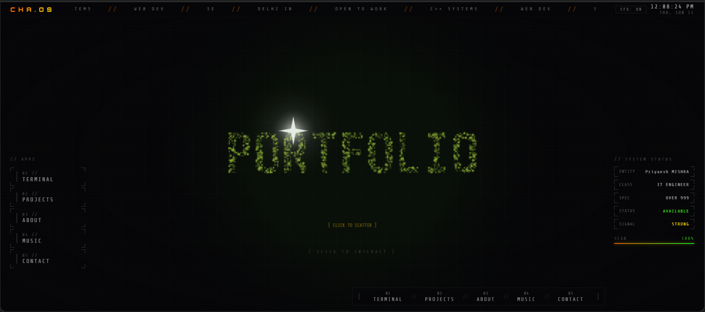

# CHA.OS — Portfolio Operating System

**Live:** https://portfolio-six-neon-pqasdizk2g.vercel.app

A portfolio built as a fake operating system. Features a reactive grain nucleus centerpiece, draggable glass windows, CRT phosphor boot screen, interactive terminal, Lissajous audio visualizer, and a full HUD desktop interface.



---

## Features

- **CRT Boot Screen** — phosphor green terminal boot sequence with scanlines and progress bar
- **Reactive Nucleus** — 1100+ grain particles in orbital rings around a north star. Click to form "PORTFOLIO" text, click again to scatter, click to reform
- **Glass Windows** — draggable, stackable windows with neon orange CRT aesthetic, corner markers and scanline overlay
- **Interactive Terminal** — type `help`, `whoami`, `skills`, `projects`, `experience`, `contact`
- **Projects** — HUD cards with animated completion bars, glitch title effect on hover
- **About Me** — typewriter bio, animated skill bars, education section
- **Music Player** — Lissajous oscilloscope visualizer reacting to L+R audio channels, 16-track playlist
- **Contact** — links to GitHub, Email, LinkedIn, LeetCode + message form
- **Sound Effects** — Web Audio API procedural SFX on boot, nucleus interaction, window open/close
- **HUD Desktop** — system status panel, scrolling ticker, live clock, app launcher

---

## Tech Stack

| Layer | Tech |
|---|---|
| Framework | Next.js 14 (App Router) |
| Language | TypeScript |
| Styling | Tailwind CSS + inline styles |
| Animation | Framer Motion |
| Audio | Web Audio API (no libraries) |
| Canvas | HTML5 Canvas (nucleus, visualizer) |
| State | Zustand |
| Fonts | Orbitron, Share Tech Mono, Rajdhani |
| Deploy | Vercel |

---

## Nucleus Interaction

The centerpiece is a canvas animation with 1140 grain particles across 3 orbital rings:

```
Click once  → particles flow into "PORTFOLIO" text formation
Click again → particles scatter outward with velocity (mouse reactive)
Click again → particles reform into orbital rings
```

Hover near the nucleus — a custom crosshair cursor appears. Hover directly over the star — crosshair turns orange.

---

## Terminal Commands

```
whoami      — identity scan
skills      — technical loadout
projects    — mission log
experience  — deployment history
contact     — communication channels
clear       — wipe terminal
hello       — initiate greeting protocol
```

---

## Project Structure

```
portfolio-os/
├── app/
│   ├── globals.css       # Design system, CRT effects, animations
│   ├── layout.tsx
│   └── page.tsx
├── components/
│   ├── BootScreen.tsx    # CRT phosphor boot animation
│   ├── Desktop.tsx       # HUD desktop layout
│   ├── DesktopIcon.tsx   # HUD app icons
│   ├── NucleusBackground.tsx  # Grain particle nucleus (canvas)
│   ├── SoundEngine.ts    # Web Audio procedural SFX
│   ├── Window.tsx        # Draggable glass window shell
│   └── apps/
│       ├── Terminal.tsx
│       ├── Projects.tsx
│       ├── AboutMe.tsx
│       ├── MusicPlayer.tsx
│       └── Contact.tsx
├── store/
│   └── windowStore.ts    # Zustand window state
└── public/
    └── music/            # MP3 files (not tracked in git)
```

---

## Local Development

```bash
git clone https://github.com/Talkxsick/portfolio-os.git
cd portfolio-os
npm install
npm run dev
```

Open `http://localhost:3000`

---

## Adding Music

1. Create `public/music/` folder
2. Add MP3 files
3. Update the `TRACKS` array in `components/apps/MusicPlayer.tsx`

---

## License

MIT — feel free to fork and make it your own.
